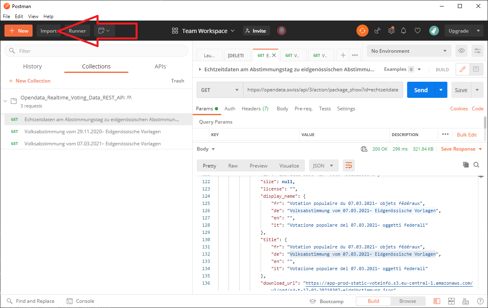

# Testing realtime voting data with Postman

On [opendata.swiss](https://opendata.swiss/de/dataset/echtzeitdaten-am-abstimmungstag-zu-eidgenoessischen-abstimmungsvorlagen) realtime voting data can be grabbed via REST API. The database is maintained by the [Federal Statistical Office (FSO)](https://www.bfs.admin.ch/bfs/en/home.html).

This repository provides a Postman collection with some data requests which should help exploring and understanding the API.

1. Postman is available for Windows, macOS and Linux. Go to [postman.com/downloads](https://www.postman.com/downloads/) and download and install.

2. Open Postman and click import as shown red in the screenshot below. Import `Opendata_Realtime_Voting_Data_REST_API.postman_collection.json` from [this repository](Opendata_Realtime_Voting_Data_REST_API.postman_collectionjson).

> There is also a [Postam team project](https://apfelschuss.postman.co/). Drop an email to apfelschuss.io@gmail.com if you want join.
